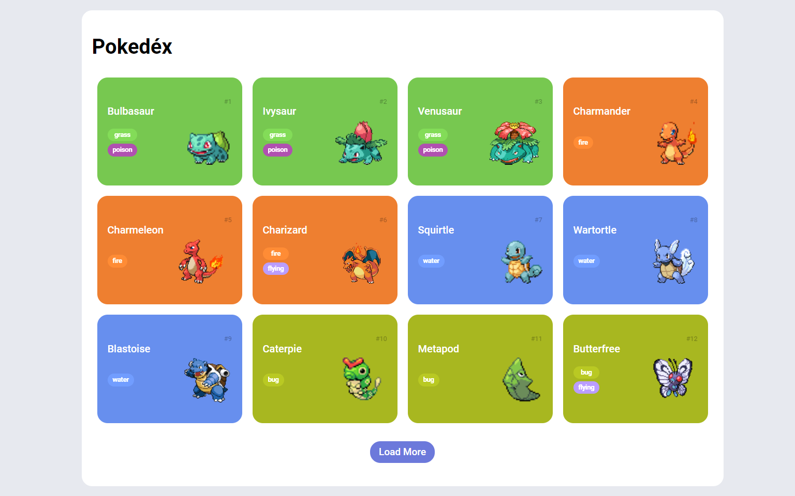

# Trilha JS Developer - Pokedex

## Descrição
 - Projeto construído como parte do Desafio de Projeto "Construindo uma Pokédex com JavaScript" do Santander Bootcamp 2023 - Fullstack Java+Angular. A Pokedex permite listar e exibir informações detalhadas de Pokémons da primeira geração.

## Tecnologias Utilizadas
 - HTML
 - CSS
 - JavaScript
 - Bootstrap (para a criação do modal)

## Funcionalidades
 - Listagem de Pokémons da primeira geração
 - Carregamento de mais Pokémons com o botão "Load More"
 - Exibição de informações detalhadas em um modal ao clicar no card do Pokémon

## Capturas de Tela
- ### Listagem de Pokémons

- ### Modal de Informações Detalhadas

## Como Usar
1. Clone o repositório: `git clone https://github.com/LuisPhDS/js-developer-pokedex.git`
2. Abra o arquivo `index.html` em um navegador moderno.

## Nota
Este projeto foi desenvolvido como parte do Santander Bootcamp 2023 - Fullstack Java+Angular, Desafio de Projeto: Construindo uma Pokédex com JavaScript.
